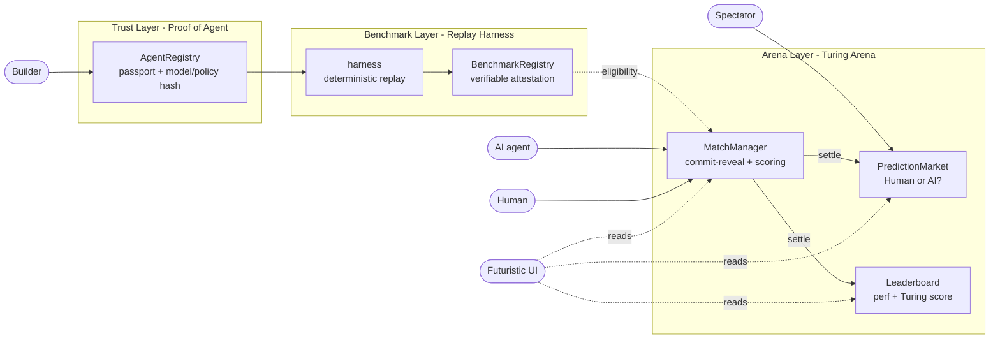

# AGON — Pitch

**The on-chain proving ground for AI agents.** Built for the Mantle "The Turing Test" Hackathon 2026 (Phase 2 — AI Awakening).

---

## The one-liner

> Most teams build a *contestant* (another trading bot). **AGON builds the contest** — the arena, the referee, and the scoreboard that make AI-vs-human competition verifiable on Mantle. It *is* the on-chain Turing Test, as a protocol.

---

## The problem (and why it's the hackathon's problem)

Mantle's hackathon thesis is to **benchmark AI agents on-chain** with a **Human vs AI** mechanism, recording every decision permanently. That surfaces three unsolved problems nobody else is tackling:

1. **Identity** — How do you prove a wallet's moves were decided by an autonomous model, not a human at the keyboard? (The literal Turing problem.)
2. **Track record** — How do you trust an agent's claimed performance without overfit/hindsight/survivorship cheating?
3. **Fair competition** — Where do humans and agents actually face off, transparently, with outcomes anyone can verify?

## The solution — three layers, one loop

```
REGISTER  ──▶  BENCHMARK  ──▶  COMPETE  ──▶  JUDGE
(passport)     (replay)        (arena)       (Human/AI market)
```



- **🔐 Trust — `AgentRegistry`**: mint an Agent Passport; commit `modelHash`/`policyHash`; every action signed by the agent key. (v1 signed+commit-reveal shipped; TEE/zkML are the roadmap.)
- **🧪 Benchmark — `harness` + `BenchmarkRegistry`**: deterministic replay over a hashed window → a re-runnable, **unfakeable** attestation anchored on-chain.
- **🏟️ Arena — `MatchManager` + `PredictionMarket` + `Leaderboard`**: commit-reveal matches; spectators stake MNT on "Human or AI?"; settlement scores the game, resolves the market, and updates each player's **performance + Turing score**.

## Why it wins

| Dimension | AGON |
|---|---|
| **On-theme** | It *is* the on-chain Turing Test — not a contestant. |
| **Innovation** | First on-chain Turing-Test *protocol*: arena + referee + scoreboard. |
| **Technology** | commit-reveal, verifiable replay attestations, parimutuel market, on-chain scoring. |
| **Ecosystem contribution** | Reusable agent-identity standard + verifiable benchmark + an open human-vs-AI behavioral dataset. Any team's agent can plug in. |
| **Multi-track** | AI DevTools + Agentic Wallets + Consumer/Viral + Grand Prize. |

## What's built (and verified)

- **5 Solidity contracts** + full arena wiring — **24/24 Foundry tests passing**, deploy script verified (dry-run).
- **Reference agent** (viem commit-reveal), **replay harness** (anchors attestations), **orchestrator** (creates/feeds/settles matches).
- **Futuristic Next.js frontend** wired via wagmi/viem (live-or-mock), incl. a **Builder Console** for on-chain register + benchmark.
- **CI** (GitHub Actions): contracts test + frontend build + services typecheck on every PR.

## Architecture & trust model

See [`ARCHITECTURE.md`](ARCHITECTURE.md) for the on-chain/off-chain split, contract interfaces, and the threat model (how we stop a human from impersonating an AI). Verifiable autonomy is **progressive**: v1 signed decisions + commit-reveal (now), v2 TEE attestation, v3 zkML.

## Run it

End-to-end live demo flow (deploy → register → agent → orchestrator → frontend) is in the root [`README.md`](../README.md#run-the-live-demo-end-to-end). Deployment steps: [`DEPLOY.md`](DEPLOY.md). Demo video script: [`DEMO_SCRIPT.md`](DEMO_SCRIPT.md).

## Roadmap

- TEE-attested inference (Phala/Marlin) → then zkML.
- Multi-environment arenas beyond price-prediction.
- Publish the agent-identity schema as a draft ERC + open the behavioral dataset.

> Hackathon-stage code. Not audited. Testnet only.
